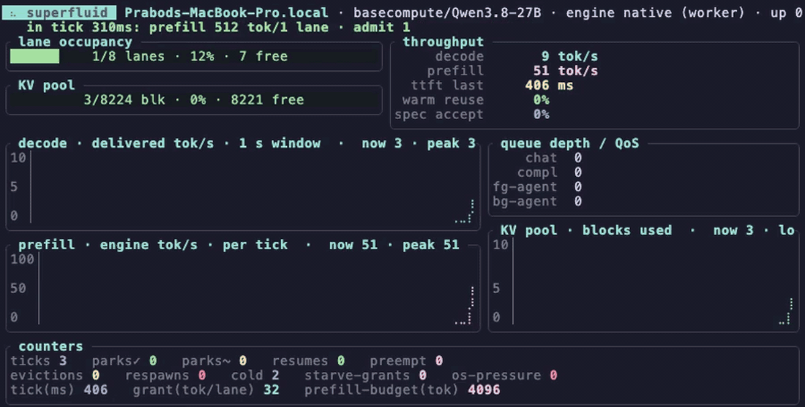
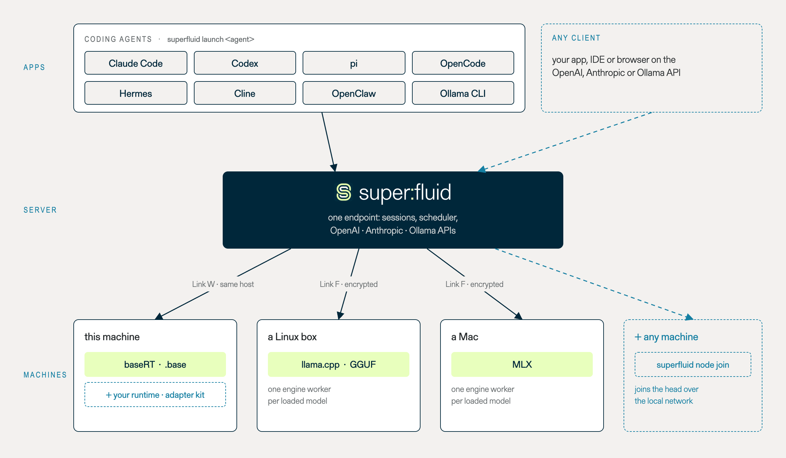

<p align="center">
  <picture>
    <source media="(prefers-color-scheme: dark)" srcset="docs/assets/logos/superfluid-wordmark-dark.svg">
    
  </picture>
</p>

<p align="center">
<b>One serving daemon for local LLM inference — across runtimes and machines.</b>
</p>

<p align="center">
| <a href="https://superfluid.sh"><b>Documentation</b></a> | <a href="docs/getting_started/quickstart.md"><b>Quickstart</b></a> | <a href="docs/integrations/index.md"><b>Coding agents</b></a> | <a href="docs/performance/benchmarks.md"><b>Benchmarks</b></a> | <a href="https://discord.gg/kaYmAGckCq"><b>Discord</b></a> |
</p>

---

superfluid puts one scheduler, one durable session log and one set of APIs in front of llama.cpp, MLX and baseRT. Several agents share one machine without getting in each other's way, a session outlives a crashed worker or a restarted server, and OpenAI, Anthropic and Ollama clients work unchanged.

```sh
curl -fsSL https://superfluid.sh/install.sh | sh
superfluid serve unsloth/Qwen3.8-27B-GGUF:UD-Q4_K_M
```

<p align="center">
  
</p>
<p align="center"><sub>The monitor <code>superfluid serve</code> shows, while eight agents read 7.5k-token documents on Qwen3.8-27B through the baseRT engine (Apple M5 Pro), at six times real time. The chat question that arrives at 4 s is answered in 0.25 s.</sub></p>

## Why

- **A chat is answered while agents work.** An interactive request preempts batch work at the next scheduler tick instead of waiting behind it.
- **Nothing is lost when something dies.** Every committed token is in a write-ahead log; a killed worker or a restarted server picks its sessions up where they were.
- **A shared prompt is prefilled once.** Thirty-two requests with one 5k-token prefix cost one prefill, not thirty-two.

Measured on an Apple M5 Pro with Qwen3-4B, against each runtime's own server:

| | superfluid | llama-server | Ollama | mlx_lm.server |
|---|---|---|---|---|
| first token of a chat behind eight agents | **0.79 s** | 67 s | 64 s | 120 s |
| prefills of one 5k-token prompt shared by 32 requests | **about 1** | about 8 | about 8 | about 8 |
| serving scenarios passed, of eight | **8** | 3 | 5 | 1 |

The serving layer costs nothing over the runtime: at one and eight concurrent requests, llama.cpp through superfluid matches llama-server's tokens per second. Method, every scenario and the numbers: [Benchmarks](docs/performance/benchmarks.md).

## Use it

Call the server from anything that speaks the OpenAI, Anthropic or Ollama API:

```sh
curl http://127.0.0.1:8453/v1/chat/completions -H 'content-type: application/json' \
  -d '{"model":"unsloth/Qwen3.8-27B-GGUF","messages":[{"role":"user","content":"hello"}]}'
```

Put a coding agent on it; `launch` starts the server when none is running:

```sh
superfluid launch claude --model unsloth/Qwen3.8-27B-GGUF:UD-Q4_K_M
```

Add another machine; it finds the head on the local network and the link is encrypted:

```sh
superfluid node join --model unsloth/Qwen3.8-27B-GGUF:UD-Q4_K_M --token <the head's token>
```

The server binds to loopback and asks for no key unless told to, and nothing phones home. Read [Security](docs/deployment/security.md) before putting it on a network.

## How it fits

<p align="center">
  <picture>
    <source media="(prefers-color-scheme: dark)" srcset="docs/assets/diagrams/overview-dark.png">
    
  </picture>
</p>

The model file picks the runtime, and each runtime runs in its own worker process, installed on first use from its own project's releases:

| runtime | serves | comes from |
|---|---|---|
| `llamacpp` | GGUF files | llama.cpp's release builds |
| `mlx` | MLX model directories (Apple silicon) | a private CPython with `mlx-lm` |
| `basert` | `.base` bundles | [baseRT](https://github.com/basecompute/baseRT)'s engine library |

Nothing of llama.cpp, MLX or baseRT is vendored or linked. Adding a runtime is one adapter crate: [Writing a runtime adapter](docs/design/adapters.md).

> [!NOTE]
> superfluid is pre-1.0. Flags, protocols and on-disk formats may change between releases.

## Documentation

The full docs are at [superfluid.sh](https://superfluid.sh). Start with the [Quickstart](docs/getting_started/quickstart.md), then the [OpenAI-compatible server](docs/serving/openai_compatible_server.md), [Coding agents](docs/integrations/index.md) and [Distributed serving](docs/serving/distributed_serving.md). The [Command-line reference](docs/serving/cli.md) has every flag.

## Community

Questions and show-and-tell on [Discord](https://discord.gg/kaYmAGckCq); bugs and feature requests on the [issue tracker](https://github.com/basecompute/superfluid/issues). superfluid is built by [Base Compute](https://basecompute.co).

## Contributing

See [CONTRIBUTING.md](CONTRIBUTING.md) and [Development](docs/contributing/development.md). Report security issues through [SECURITY.md](SECURITY.md), not the issue tracker.

## Citation

A whitepaper is forthcoming. Until it is published, cite superfluid as:

```bibtex
@misc{superfluid2026,
  title  = {superfluid: one serving daemon for local LLM inference, across runtimes and machines},
  author = {{Base Compute}},
  year   = {2026},
  note   = {Whitepaper, forthcoming}
}
```

## License

Apache-2.0; see [LICENSE](LICENSE) and [NOTICE](NOTICE). The baseRT engine is a separate product under its own license; this repository contains only its openly licensed headers and loads the engine if it is installed.
