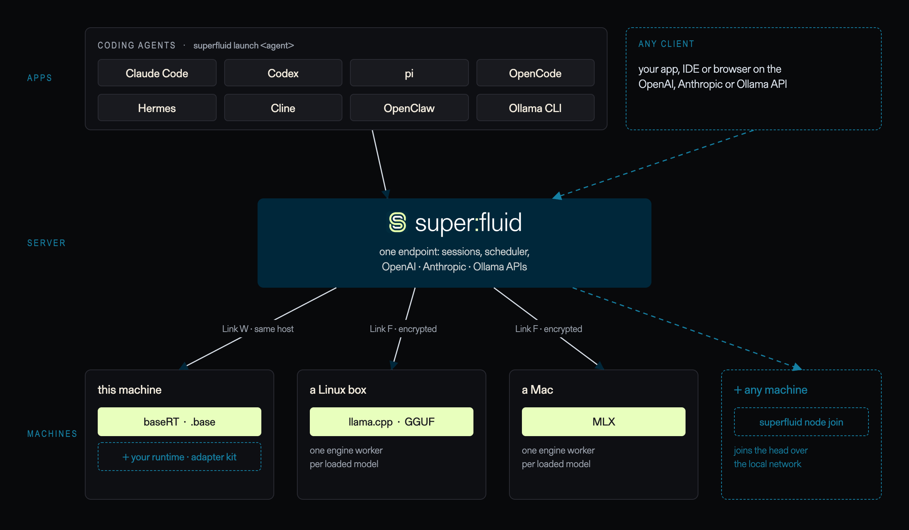

# superfluid documentation

**One serving daemon for local LLM inference — across runtimes and machines.**

<!-- source: assets/diagrams/overview-dark.html (light: overview.html); render at 2x to the matching .png -->


superfluid is a serving daemon for local LLM inference. It puts one scheduler, one durable session log and one set of APIs (OpenAI, Anthropic, Ollama) in front of several inference runtimes: llama.cpp for GGUF files, MLX for MLX directories, and the baseRT engine for `.base` bundles.

```sh
superfluid serve unsloth/Qwen3.8-27B-GGUF:UD-Q4_K_M
```

## Getting started

- [Installation](getting_started/installation.md)
- [Quickstart](getting_started/quickstart.md)

## Serving

- [OpenAI-compatible server](serving/openai_compatible_server.md)
- [OpenAI Responses API](serving/responses_api.md)
- [Anthropic Messages API](serving/anthropic_api.md)
- [Ollama-compatible API](serving/ollama_api.md)
- [Session API](serving/session_api.md)
- [Command-line reference](serving/cli.md)
- [Configuration](serving/configuration.md)
- [Serving multiple models](serving/multiple_models.md)
- [Distributed serving (fleet mode)](serving/distributed_serving.md)

## Integrations

- [superfluid launch](integrations/index.md): [Claude Code](integrations/claude_code.md), [Codex](integrations/codex.md), [pi](integrations/pi.md), [OpenCode](integrations/opencode.md), [Hermes Agent](integrations/hermes.md), [Cline](integrations/cline.md), [OpenClaw](integrations/openclaw.md), [Ollama CLI](integrations/ollama_cli.md)

## Models

- [Supported models](models/supported_models.md)
- [Runtimes](models/runtimes.md)

## Features

- [Tool calling](features/tool_calling.md)
- [Chat templates and reasoning](features/chat_templates.md)
- [Structured outputs](features/structured_outputs.md)
- [Sampling](features/sampling.md)
- [Speculative decoding](features/speculative_decoding.md)
- [Vision and audio](features/multimodal.md)
- [Sessions and prefix caching](features/sessions.md)
- [Scheduling and QoS](features/scheduling.md)

## Deployment

- [Security](deployment/security.md)
- [Observability](deployment/observability.md)

## Design

- [Architecture](design/architecture.md)
- [Writing a runtime adapter](design/adapters.md)

## Performance

- [Benchmarks](performance/benchmarks.md)

## Contributing

- [Development](contributing/development.md)
- [Discord](https://discord.gg/kaYmAGckCq)
- [Contributing guide](https://github.com/basecompute/superfluid/blob/main/CONTRIBUTING.md)
- [Security policy](https://github.com/basecompute/superfluid/blob/main/SECURITY.md)
