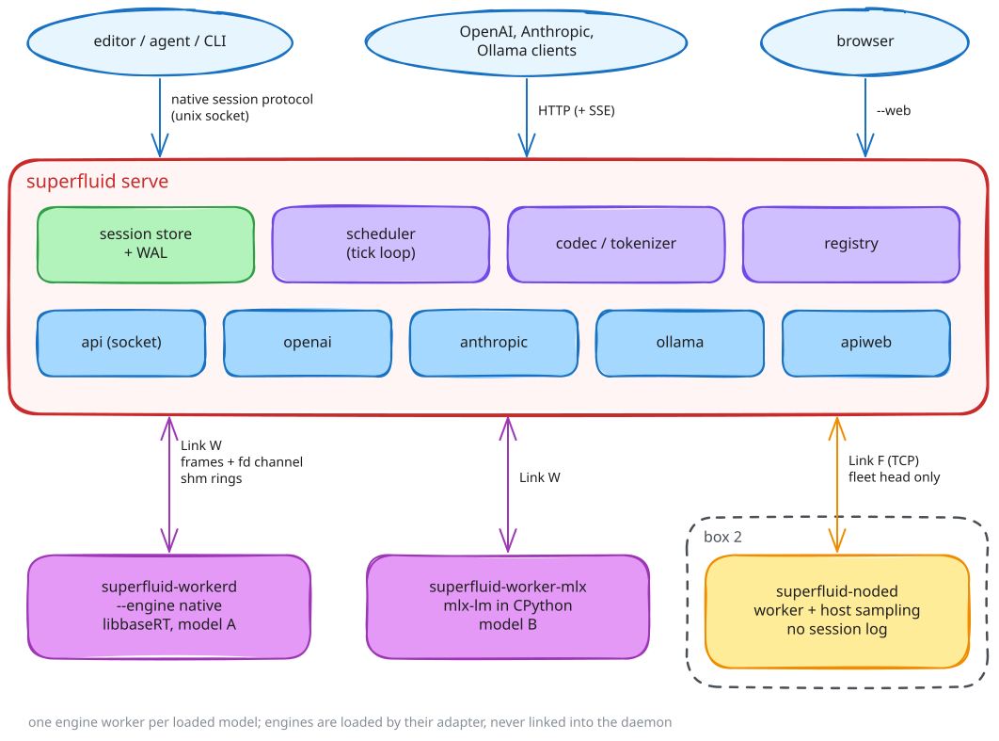

# Architecture

superfluid is split into processes: the daemon, which owns sessions, policy and every API; one engine worker per loaded model, which owns the GPU state; and, in fleet mode, node agents on other hosts. Everything above the engine is Rust. The engines (libbaseRT, llama.cpp, MLX) are loaded at run time by their adapter and never linked into the daemon.

## Processes

| process | binary | owns |
|---|---|---|
| daemon | `superfluid serve` | session log, scheduler, chat template and tokenizer, HTTP and socket APIs, model registry |
| engine worker | `superfluid-workerd --engine <id>` or `superfluid-worker-<id>` | one loaded model: weights, KV pool, prefix cache, sampling |
| node agent | `superfluid-noded` | a worker on a fleet node, plus sampling; nothing durable |

<!-- source: docs/assets/diagrams/architecture.excalidraw; edit it in excalidraw.com and export the SVG over architecture.svg -->

## Links

| link | between | transport | version |
|---|---|---|---|
| Link W | daemon and worker, same host | two unix sockets (frames on fd 3, `SCM_RIGHTS` descriptors on fd 4) plus shared-memory rings | 8 |
| Link F | fleet head and node | TCP, same frame envelope | 2 |

Both share one frame envelope: `u32 len | u16 proto_version | u16 msg_type | u64 seq | u64 correlation_id | u8 class | payload`, little-endian, postcard payloads, 16 MiB cap. A peer at another version fails the handshake.

Token spans and logits rows never ride the frames. Each worker has three shared-memory rings allocated by the daemon: an inbound token ring for prompts (64 slots of one context window), an outbound token ring (64 slots of 1024 tokens) and a logits ring (8 vocabulary-wide rows) for host-sampled lanes. Slots carry a generation counter so a recycled slot is detected rather than read torn.

Link F carries sessions, not ticks: assignments with epochs and leases, prompt tokens, generate requests, sampled tokens back, and watermark acks. See [Distributed serving](../serving/distributed_serving.md).

## Request path

1. **HTTP.** Parse, authenticate, apply rate and key limits, resolve the model and QoS class.
2. **Codec.** Render the conversation through the model's dialect into token spans; compile tools and `response_format` into grammars. Tokenization happens in the daemon; workers see only token ids.
3. **Session log.** Commit each message span and the assistant-turn opener to the WAL before generating.
4. **Admission.** Check the context window, mark the session busy, queue a job with its class, sampling parameters and grammar.
5. **Scheduler.** One thread per model admits jobs into lanes (seeding from the prefix cache or a park artifact) and builds a tick plan: admits, prefill chunks, decode grants, retires.
6. **Worker.** The plan crosses Link W; the engine validates it whole, then runs retires, commits, admits, prefills and decodes, streaming tokens mid-tick.
7. **Commit.** The scheduler routes tokens into text, reasoning and tool-call channels, commits them to the WAL, then hands committed events to the request. Provisional deltas stream ahead of the commit and are always a prefix of the committed text.
8. **Stream.** Events become SSE chunks or socket frames. A finished lane retires next tick and publishes its KV to the prefix cache.

## Engine abstraction

Every runtime is driven through one trait, `superfluid_engine::Engine`, centred on `tick(plan) -> events`. Around it sit prefix-cache operations, state snapshot/restore, sequence lifecycle, grammar and logit-bias handles, embeddings, transcription, LoRA and media. Most have a default that returns `Unsupported`; the capability record a worker sends at handshake tells the daemon what a model honours.

A runtime plugs in one of two ways:

| kind | implements | examples |
|---|---|---|
| full engine | `Engine` itself | baseRT, through `superfluid-engine-ffi` over libbaseRT's tick ABI |
| primitive runtime | `RuntimePrimitives` (`describe`, sequence create/free/copy/truncate, export/import, one packed `step`) | llama.cpp, MLX |

For primitive runtimes, `superfluid-executor` implements the whole tick contract once: lanes, host sampling, the prefix cache, grammars, logprobs, park and resume. Primitive runtimes declare `serving.round_granular`, and the scheduler plans shorter ticks for them.

The sampling RNG is counter-based (`seed + stream position`), so a continuation after a cut, fork or resume draws what the uninterrupted lane would have.

## Crate map

| crate | responsibility |
|---|---|
| `superfluid` (in `crates/superfluid-daemon`) | the daemon: session store and WAL, scheduler, codecs, every API, registry, fleet head and node agent, the binaries |
| `superfluid-engine` | `Engine` and `Tokenizer` traits, the mock engine, the tick-contract test harness |
| `superfluid-executor` | the generic executor over `RuntimePrimitives` |
| `superfluid-adapters/*` | the adapter kit and one crate per runtime |
| `superfluid-worker`, `superfluid-agent` | Link W server (worker side) and client (daemon side) |
| `superfluid-proto` | frame envelope and the Link W / Link F message catalogs; no I/O |
| `superfluid-shm` | shared-memory segments, rings, fd passing |
| `superfluid-linkf` | Link F session layer: epochs, leases, watermarks, reconcile |
| `superfluid-abi` | the tick ABI as `#[repr(C)]` Rust types |
| `superfluid-engine-ffi` | the baseRT engine through the tick ABI |
| `superfluid-fingerprint` | behaviour fingerprints recorded in the session log |
| `superfluid-tokenizer-hf` | Hugging Face `tokenizer.json` tokenization |

Dependencies point one way: the daemon depends on everything; adapters on the kit; the kit on the executor and worker; those on the engine and ABI crates. `superfluid-proto` and `superfluid-abi` depend on nothing.

## Crash isolation

| failure | what happens |
|---|---|
| worker dies | active lanes fail with an error; the worker is respawned, speculation re-registered, and sessions continue by re-prefilling or restoring a park artifact. Three respawns without a successful tick stop retrying until the next request |
| daemon dies | nothing acknowledged is lost; the WAL replays, and an epoch bump fences any generation owner from before the crash |
| a tick fails | its lanes are retired cleanly and their callers get the error; serving continues |
| one lane faults | that lane stops with `finish = ERROR`; the tick's other lanes continue |
| in-process worker (`--no-worker-process`) | shares the daemon's fate; the WAL still makes restart lossless |

## Design principles

- **Sessions, not requests.** A session is an append-only log; GPU state can be rebuilt from it. Caches and park artifacts are optimizations, never truth.
- **Committed spans are recorded verbatim** as token ids, so replay never re-renders text.
- **Only committed events have ids.** Provisional deltas are opt-in and carry none.
- **Everything is a lane.** Chat, agents, media, grammar and speculation share one scheduling path.
- **Policy stays in the daemon;** the engine executes a plan.
- **Fault isolation by process.** A GPU fault kills one worker; sessions survive.
- **Telemetry is content-free and lossy by contract.**
