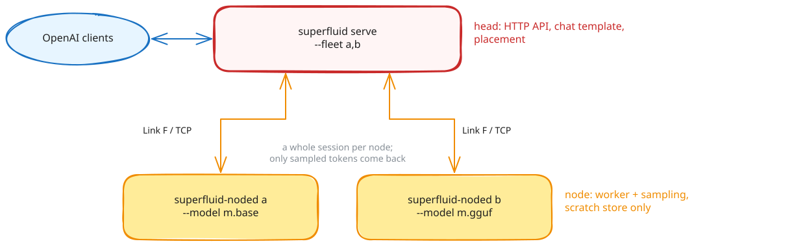

# Distributed serving (fleet mode)

Fleet mode runs one superfluid as a **head** that owns the HTTP API and the chat template, and one or more **node agents** (`superfluid-noded`) that each own a model and sample its tokens. Each request is placed as a whole session on one node; only sampled tokens cross the network.

> [!WARNING]
> Fleet mode is early. The head keeps no durable session log and serves two routes.

<!-- source: docs/assets/diagrams/fleet.excalidraw; edit it in excalidraw.com and export the SVG over fleet.svg -->


## Join a node

On the head, make the token once and start serving with a listener for nodes:

```sh
superfluid fleet token                     # prints the token; kept at ~/.superfluid/fleet/token
superfluid serve unsloth/Qwen3.8-27B-GGUF:UD-Q4_K_M --http 0.0.0.0:8453 --fleet-listen 0.0.0.0:8454
```

On each node:

```sh
superfluid node join --model unsloth/Qwen3.8-27B-GGUF:UD-Q4_K_M --token <the token>
```

The node finds the head on the local network (`_superfluid-fleet._tcp`, or give `<host:port>` as the first argument), pulls the model as `serve` would, serves it over an encrypted link, and dials again whenever the link drops, looking for the head anew when it moved. The head lists a node that joined as `joined:<identity>` and places sessions on it like any other; a node that leaves is waited for, not dialed. The head matches nodes by model name: a node names its model as the head announced it, so the same model under another id or path still matches; `--model-name` overrides that. A head with no token takes nodes from its own machine only.

| flag | default | meaning |
|---|---|---|
| `--model <path\|id>` | required | the model; an id is pulled first |
| `--token <value>` | `$SUPERFLUID_HOME/fleet/token` | the head's token, kept at that path |
| `--runtime <id>` | by format | the runtime |
| `--max-context <N>` | sized for this device | the node's window |
| `--max-batch <N>` | 8 | the node's lanes |
| `--identity <name>` | the host name | the name in the head's logs |
| `--model-name <id>` | what the head announces, else the model's id | the name the head matches on |
| `--offline` | off | pull nothing |

A node that joins opens one connection per lane, and the head runs one generation per connection, so a node runs as many generations at once as it has lanes, joined or dialed.

## Run a node by hand

```sh
superfluid-noded --model unsloth/Qwen3.8-27B-GGUF:UD-Q4_K_M --listen 100.64.0.2:8454
```

The node loads the model as `superfluid serve` does: an id is pulled, the runtime that reads it is installed if it never was, and the window is sized for the device. It checks its token and binds its port first, so a node that would be refused stops before it downloads anything. It then prints what it serves:

```text
superfluid-noded: runtime llamacpp serves /…/Qwen3.8-27B-UD-Q4_K_M.gguf: context window 40960 tokens (sized for this device), 8 lanes
superfluid-noded: node 'box-a' serving 'unsloth/Qwen3.8-27B-GGUF' on 100.64.0.2:8454 (Link F/TCP)
```

| flag | default | meaning |
|---|---|---|
| `--listen <ip:port>` | `0.0.0.0:8454` | where the head connects |
| `--model <path\|id>` | required | the model; an id is pulled first |
| `--runtime <id>` | by format | `basert`, `llamacpp` or `mlx`; `--engine` is the same flag, and `--engine mock` serves the test engine |
| `--model-name <id>` | the model's id | the name the head matches on; set it the same on every node |
| `--max-context <N>` | sized for this device | the node's window, floor 512 |
| `--max-batch <N>` | 8 | the node's lanes |
| `--identity <name>` | the host name | the name in the head's logs |
| `--offline` | off | pull and install nothing |
| `--auth-file <path>` | `$SUPERFLUID_HOME/fleet/token` | the fleet token; with it the link is encrypted and both ends are checked |
| `--insecure-no-auth` | off | accept any peer on a non-loopback address |
| `--handshake-timeout-ms <N>` | 10000 | time a connecting head has to say hello |
| `--idle-timeout-ms <N>` | 120000 | drop an idle connection |

Nodes can run different runtimes for the same model, such as a Mac on baseRT with the `.base` build and a Linux box on llama.cpp with a GGUF. Give each the same `--model-name`. The head sends token ids, so the builds must share the model's tokenizer, which builds of one model do; nothing checks this yet. Each node's answers follow its own build's quantization.

`superfluid fleet token` makes the token (32 random bytes as hex, owner-readable) at `$SUPERFLUID_HOME/fleet/token` on the head; copy that file, or its value, to the same path on each node. With a token the link between head and node is encrypted (Noise, keyed by the token) and a peer with another token is refused at the handshake. A node bound off loopback refuses to start without a token unless `--insecure-no-auth` is given. A node has no sampling flags and no durable state: `superfluid-noded` keeps its session store under the system temp dir, and `node join` under `$SUPERFLUID_HOME/fleet/nodes/<identity>`, emptied at each start.

## Run the head

```sh
superfluid serve /models/qwen.base --http 0.0.0.0:8453 \
    --fleet 100.64.0.2:8454,100.64.0.3:8454 \
    --fleet-auth /etc/superfluid/fleet.key
```

At start the head connects to every node and reports each one, or why it cannot reach it:

```text
superfluid: fleet node 'box-a' at 100.64.0.2:8454: qwen, context window 32768 tokens, 8 lanes
superfluid: fleet node 100.64.0.3:8454: closed the connection at the handshake; check that --fleet-auth holds the key in the node's --auth-file; retrying it every 10 s
superfluid: context window 32768 tokens (the largest node's)
```

| flag | default | meaning |
|---|---|---|
| `--fleet <host:port>[,...]` | | nodes the head dials; optional with `--fleet-listen` |
| `--fleet-listen <addr:port>` | off | take nodes that join, announced on the local network |
| `--fleet-auth <path>` | `$SUPERFLUID_HOME/fleet/token` | the fleet token; without one the links are not encrypted |
| `--fleet-policy` | `load-aware` | `load-aware`, `least-loaded` or `round-robin` |
| `--fleet-pool-high <pct>` | 90 | `load-aware` avoids nodes at or above this KV occupancy |
| `--fleet-conns-per-node <N>` | the node's lanes | connections to each node in `--fleet`, and so concurrent generations there |

The head loads no engine but still reads the model for its tokenizer and chat template; its model id must match what the nodes advertise (the head warns about a node that serves another). Its context window is the nodes', so it needs no `--max-context`. It logs where each session is placed and every move to another node. `--dialect`, `--tool-call-parser` and `--temperature`/`--top-p`/`--top-k`/`--min-p` apply on the head. `--api-key`, `--key-policy` and `--rate-limit` protect its listener; a policy's `class` and `max_class` do not apply, since the head has no scheduler.

Refused on the head (set them on each node's own `superfluid serve`): `--class-lanes`, `--http-default-qos`, `--no-http-qos-header`, `--http-allow-batch-invariant`, `--spec-max-temperature`, `--fim-model`, `--repeat-penalty`, `--otlp-endpoint`.

## Placement policies

| policy | how it picks |
|---|---|
| `load-aware` (default) | prefers nodes whose window fits the prompt, skips nodes above `--fleet-pool-high`, then the lowest estimated completion time from each node's reported rates. A node measures its rates only while it is generating, so an idle node keeps the speed it showed when busy; one that has not generated yet counts at the mean of the others |
| `least-loaded` | fewest sessions in progress plus requests in flight on that node, whatever its speed |
| `round-robin` | rotate through capable nodes; use it to prove a fleet is distributing |

A prompt no node can hold is refused with `context_length_exceeded`.

## What the head serves

- `POST /v1/chat/completions`, streaming or not, with tools ([OpenAI API](openai_compatible_server.md)).
- `GET /v1/models`: the one model the fleet serves.

Refused with 400: non-zero `presence_penalty`/`frequency_penalty`, a `repeat_penalty` other than 1.0, `ignore_eos`, `stream_options.continuous_usage_stats`, and image or audio parts. Not read: `logprobs`, `logit_bias`, `response_format`, `tool_choice`. There is no `/health`, `/metrics`, Anthropic, Ollama, embeddings, files or batches surface on the head. A generation has a ten-minute wall-clock ceiling.

## Failure handling

| event | what happens |
|---|---|
| node fails mid-stream | delivered tokens become context; the session is re-placed on the next capable node, which generates the rest. No token is delivered twice |
| node unreachable | skipped; the head tries it again every 10 s and uses it once it answers |
| node restarts | comes back empty; the head reconnects and new placements use it |
| connection idle | the head sends a keepalive every 15 s, under the node's `--idle-timeout-ms`; a connection a node closed anyway is replaced before it is used |
| head restarts | in-flight requests fail; placement state is lost |
| head misses a lease renewal | the node fences the session and emits nothing more |

## Limits

- One model per fleet.
- No KV transfer between nodes: a failover re-prefills.
- No QoS class crosses the wire.
